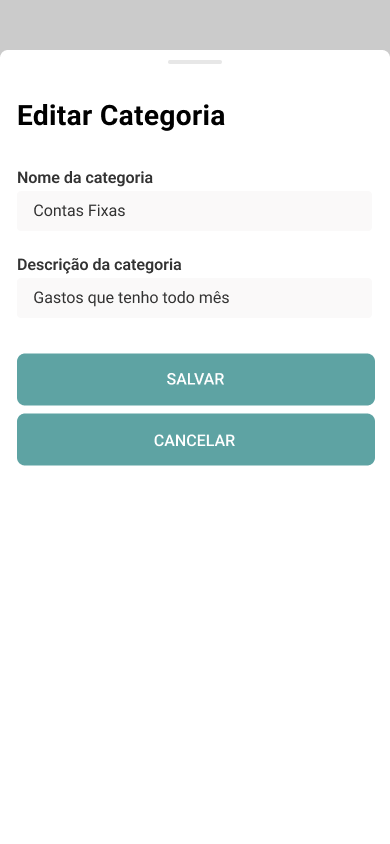
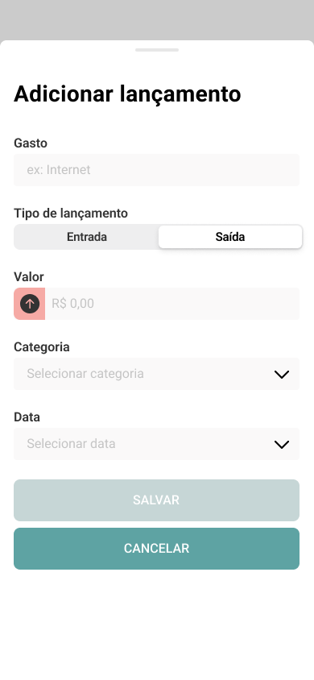

# DesafioTecnicoFlutter-MeusGastos

## Desafio tecnico de Flutter - App Meus gastos

O objetivo deste teste é avaliar as habilidades do candidato em desenvolver um aplicativo para
controle de gastos.

Os protótipos de telas estão no repositório para desenvolvimento do layout.

## **Requisitos de negócio:**

- No primeiro acesso ao aplicativo, o usuário deverá fazer o registro;
- Tratamento de erros no processo de login;
- Cadastro de categorias de gastos, como:
    - Moradia (aluguel)
    - Alimentação
    - Transporte
    - Educação
- O usuário poderá cadastrar entradas e saídas de gastos;
    - Cadastrar no mínimo 2 valores, 1 entrada e 1 saída, para cada categoria.
- Possibilidade de exclusão e edição dos gastos e categorias cadastrados;
- Tratamento de erros nas requisições com o Firebase;
- Na tela de Gastos, exibir totalizadores com a soma dos valores de entrada e saída.

## **Requisitos técnicos:**

- Utilizar última versão do Flutter do Stable channel disponível
  em https://docs.flutter.dev/release/archive;
- Respeitar os princípios do SOLID;
- Boas práticas, CleanCode;
- Aplicar Design Patterns, orientação a objetos e boas práticas de programação;
- Utilizar componentização de Widgets;
- Seguir a arquitetura Clean Architecture;
- Implementar o login utilizando o Firebase;
- Utilizar o Firestore Database para registros;
- Os testes unitários são opcionais, porém recomendados.

| Não envie a solução como anexo, suba os fontes para seu Github (ou outro repositório) e envie o
link para o avaliador.

## Login

<kbd>
  
  
</kbd>

## Categorias

<kbd>
  
  
  
   
  
  
</kbd>

## Gastos

<kbd>
  
  
  
   
  
   
  
  
  
</kbd>
